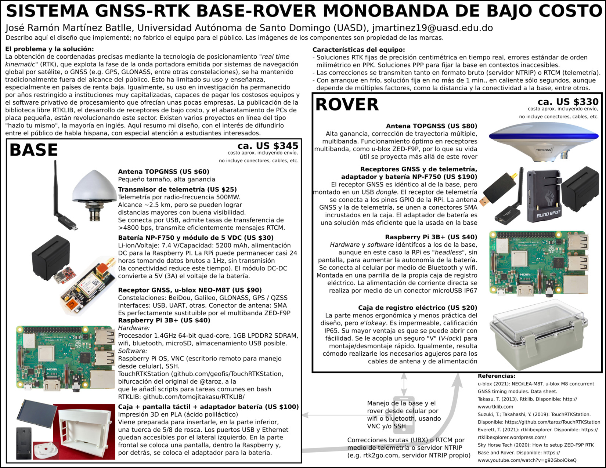
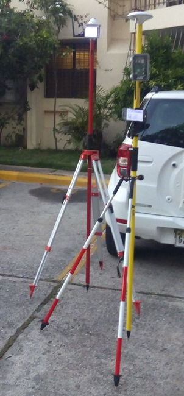
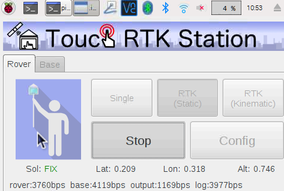
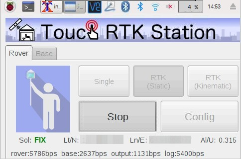
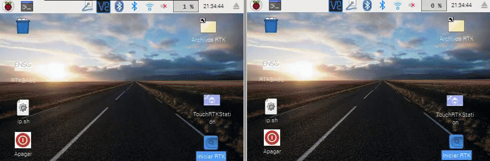

# TouchRTKStation GF
**Sistema GNSS-RTK base-rover monobanda de bajo costo** <br>
*Por José Ramón Martínez Batlle, Universidad Autónoma de Santo Domingo (UASD), jmartinez19@uasd.edu.do*

> Bifurcado desde [aquí](https://github.com/taroz/TouchRTKStation) / Forked from [here](https://github.com/taroz/TouchRTKStation)

## El problema y la solución

La obtención de coordenadas precisas mediante la tecnología de posicionamiento "real time kinematic" (RTK), que explota la fase de la onda portadora emitida por sistemas de navegación global por satélite, o GNSS (e.g. GPS, GLONASS, entre otras constelaciones), se ha mantenido tradicionalmente fuera del alcance del público. Esto ha limitado su uso y enseñanza, especialmente en países de renta baja. Igualmente, su uso en investigación ha permanecido por años restringido a instituciones muy capitalizadas, capaces de pagar los costosos equipos (normalmente, de miles y decenas de miles de dólares) y el software privativo de procesamiento que ofrecían unas pocas empresas.

La publicación de la biblioteca libre RTKLIB, el desarrollo de receptores de bajo costo, y el abaratamiento de PCs de placa pequeña, están revolucionando este sector. Existen varios proyectos en línea del tipo "hazlo tu mismo", la mayoría en inglés. Aquí resumo mi diseño, con el interés de difundirlo entre el público de habla hispana, con especial atención a estudiantes interesados.

## Características del equipo

- Soluciones RTK fijas de precisión centimétrica en tiempo real, errores estándar de orden milimétrico en PPK. Soluciones PPP para fijar la base en contextos inaccesibles.

- Las correcciones se transmiten tanto en formato bruto (servidor NTRIP) o RTCM (telemetría).

- Con arranque en frío, solución fija en no más de 1 min., en caliente sólo segundos, aunque
  depende de múltiples factores, como la distancia y la conectividad a la base, entre otros.

## Diseño elegido

En cuanto a hardware, para la base implementé la propuesta de [Suzuki, T.; Takahashi, Y. (2019)](https://github.com/taroz/TouchRTKStation); para el rover, preferí un arreglo *headless*, inspirado en la propuesta de [Sky Horse Tech (2020)](https://www.youtube.com/watch?v=g92GboiOkeQ). En cuanto a software, todo es de código abierto; el *frontend* es una bifurcación [TouchRTKStation](https://github.com/geofis/TouchRTKStation), a la cual le incluí automatización de tareas comunes en bash y algunas mejoras en la interfaz PyQt; en el *backend* usé la implementación *demo5* de [Everett, T. (2021)](https://rtklibexplorer.wordpress.com/), la cual se basa en RTKLIB de [Takasu, T. (2013)](http://www.rtklib.com).

<br>
*Diseño elegido*

<br>

<br>
*El dúo sobre trípodes/palos y en funcionamiento*

<br>

<br>
*Captura de pantalla de la interfaz en funcionamiento. Este fix se logró en interiores, con base y rover localizados a cm de separación. Correcciones en formato RTCM vía rtk2go; mismo resultado por telemetría. Coordenadas ENU*

<br>

<br>
*Otra captura de pantalla, la interfaz recibiendo correcciones por telemetría.*

<br>
*Animación de fix en interiores, correcciones desde rtk2go.*


## Instalación

1. Conecta la Raspberry Pi a Internet.

2. Descarga TouchRTKStation  
    `cd /home/pi/`  
    `git clone https://github.com/geofis/TouchRTKStation.git`

3. Si dispones de pantalla táctil de 4 pulgadas, quita los símbolos de comentario (`#`) a las líneas debajo de la sección `# Install LCD Driver. Uncomment if LCD is available` del archivo instalador localizado en `/home/pi/TouchRTKStation/install/Install.sh` (abrir con, por ejemplo, `nano`), tal como se muestra a continuación:

    ```
    # Install LCD Driver. Uncomment if LCD is available
    cd /home/pi/
    wget http://www.waveshare.com/w/upload/0/00/LCD-show-170703.tar.gz
    tar xzvf LCD*.tar.gz
    cd ./LCD-show/
    chmod +x LCD4-show
    ./LCD4-show
    ```

Si no dispones de pantalla, fija la resolución en 720x480 mediante `sudo raspi-config`, elige `Advanced Options>Resolution`, y continua en el paso 4.

4. Instala TouchRTKStation y compila RTKLIB.
    `cd /home/pi/TouchRTKStation/install`  
    `sudo sh Install.sh`

5. Ejecuta TouchRTKStation mediante el ícono `iniciar RTK` del Escritorio.

6. Para salir de TouchRTKStation, clic-derecho (en pantalla táctil, este gesto equivale a "presionar y esperar"; en VNC Viewer desde el celular, tap con dos dedos y esperar), menú contextual, `Close Window`.

7. Habilita SSH y VNC. Ejecuta `sudo raspi-config`, elige `Interfacing Options`,  luego `SSH` y finalmente `VNC`. Instala VNC Viewer en tu celular, identifica la IP de la Raspberry y configura una conexión. Configura la Raspberry para conectar usando Bluetooth siguiendo las instrucciones del archivo [`notas_para_configurar_bluetooth_punto_acceso_red`](install/notas_para_configurar_bluetooth_punto_acceso_red).

## TO-DO list

- Lista completa de partes + ensamblaje
- Uso

## Referencias

- u-blox (2021): NEO/LEA-M8T. u-blox M8 concurrent GNSS timing modules. Data sheet.
- Takasu, T. (2013). Rtklib. Disponible: http://www.rtklib.com
- Suzuki, T.; Takahashi, Y. (2019): TouchRTKStation. Disponible: https://github.com/taroz/TouchRTKStation
- Everett, T. (2021): rtklibexplorer. Disponible: https://rtklibexplorer.wordpress.com/
- Sky Horse Tech (2020): How to setup ZED-F9P RTK Base and Rover. Disponible: https://www.youtube.com/watch?v=g92GboiOkeQ


>*Original version of README from this line*

# TouchRTKStation
日本語で説明は[**こちら**](https://qiita.com/taroz/items/fe5373848153430bf19d)

## Introduction
- TouchRTKStation is an open-source single-frequency RTK-GNSS rover and base station project
- Single frequency GNSS antenna/receiver+ Raspberry Pi + Touchscreen + RTKLIB + Case


## Functions
### Rover station
- GNSS raw data and RTK-GNSS solutions can be stored in USB memory
- Single point positioning, Kinematic RTK-GNSS, and Static RTK-GNSS are supported

### Base station
- GNSS raw data can be stored in USB memory
- TCP server, Ntrip Server, and Ntrip caster functions can be used to transmit GNSS data to a rover station
- Wireless communication devices such as ZigBee can be used

## Features
- Using [RTKLIB](https://github.com/tomojitakasu/RTKLIB) for processing GNSS data
- This project is inspired by [RTKLIB_Touchscreen_GUI](https://github.com/Francklin2/RTKLIB_Touchscreen_GUI)
- To compared with [RTKLIB_Touchscreen_GUI](https://github.com/Francklin2/RTKLIB_Touchscreen_GUI)
  - More smaller (5 inch => 4 inch)
  - Simple implementation using RTKLIB applications (rtkrcv and str2str)
  - GUI is developed by PyQT and easily customizable

## How to assemble
### Parts
<p>

- **Case:**  Create using 3D printer (STL data is [here](https://github.com/taroz/TouchRTKStation/blob/master/3D))
  - Or buy from [Shapeways](https://www.shapeways.com/shops/tarosuzuki)
- **GNSS receiver:** u-blox M8T [CSG shop](http://www.csgshop.com/product.php?id_product=205)
- **Mini-USB cable:**
- **GNSS antenna:** Tallysman TW3710 or TW3740 (GPS+GLO+BDS L1) [Digi-Key(TW3710)](https://www.digikey.com/products/en?keywords=tw3710) or  [Digi-Key(TW3710)](https://www.digikey.com/products/en?keywords=tw3740)  
- **Raspberry Pi 3:**
- **micro SD card:**
- **TNC(P)-SMA(J) connector:**
- **SMA(P)-SMA(P) cable:**
- **4inch Display:** Waveshare 4inch_RPi_LCD [Waveshare](https://www.waveshare.com/4inch-rpi-lcd-a.htm)
- **DC-DC converter:** 7.4V to 5V [Strawberry Linux](https://strawberry-linux.com/catalog/items?code=18697), [Amazon](https://www.amazon.com/DZS-Elec-Converter-Regulator-Charging/dp/B07121W7Q4/ref=sr_1_5?ie=UTF8&qid=1533692135&sr=8-5&keywords=dc%2Bconverter%2B5v%2Busb&dpID=51rETi5CNdL&preST=_SY300_QL70_&dpSrc=srch&th=1)
- **micro-USB cable:**
- **Battery holder:** Lilliput Battery Plate for Sony Battery F-970 [eBay](https://www.ebay.com/itm/LILLIPUT-Battery-Adapter-Base-Plate-F970-for-Sony-VX2100E-HVR-V1C-F330-/371421670220), [Amazon](https://www.amazon.com/Battery-Adapter-VX2100E-Lilliput-Accessory/dp/B009SJIG0K)
- **Battery:** Sony NP-F550/F570 (2900mAh) or NP-F750/F770 (5000mAh) [Amazon](https://www.amazon.com/dp/B07DC5RYPM/ref=cm_sw_em_r_mt_dp_U_qOHnCbFWY47XD)
- **5/8 inch nut:**
- **Ground plane:**

## Setup (Hardware)
- Modify the battery holder
- Open and directly connect to the DC-DC converter  
<p> 
<p>  

- Mount the battery holder to the main case  
<p>  

- Mount Raspberry Pi to the main case  
<p>  

- Mount the Tallysman GNSS antenna to the top plate  
 <p>  

- Connect the GNSS antenna cable to the GNSS receiver.
- Connect the USB cables  
<p>  

- Mount the touch screen and put the top plate to the main case  
<p>  

## Setup (Software)
### Install Raspbian
- See [here](https://www.raspberrypi.org/documentation/installation/installing-images/)

### Install TouchRTKStation
1. Connect the Raspberry Pi to the internet.
2. Download the TouchRTKStation  
    `$ cd /home/pi/`  
    `$ git clone https://github.com/taroz/TouchRTKStation.git`
3. Connect the 4inch touch screen to the Raspberry Pi. Run Install.sh  
    `$ cd /home/pi/TouchRTKStation/install`  
    `$ sudo sh Install.sh`
4. 4inch touch screen is enabled. If you want to return back to HDMI output,   
    `$ cd LCD-show`  
    `./LCD-hdmi`
5. Run TouchRTKStation  
    `$ sudo python3 /home/pi/TouchRTKStation/TouchRTKStation.py`
6. If you want to quit the TouchRTKStation, use Alt+F4
7. If you want to automatically start the TouchRTKStation  
    `$ cd /home/pi/TouchRTKStation/install`  
    `$ sudo sh Autostart.sh`

## How to use
1. Insert a USB memory to the Raspberry Pi. GNSS raw data (.ubx file) is stored in the USB memory. In the rover mode, positioning results (.pos file) are also stored. If there is no USB memory, GNSS data are stored in the home directory of the Raspberry Pi.
2. To connect NTRIP caster or NTRIP server in the rover mode, or to connect a rover in the base mode, a network connection via WiFI is needed. The wireless communication device such as ZigBee dongle, which can be recognize as USB serial port, is also can be used.

### Rover mode
 

1. Select “**Rover**” tab. Select “**Single**”，”**RTK(Static)**”, or “**RTK(Kinematic)**”
2. Push “**Config**”.  For RTK-GNSS, setup the input stream information in the “**Correction1**” tab. If ZigBee or any wireless communication device, which are recognized as USB serial port, is used to receive the GNSS data, setup the input stream information in “**Correction2**” tab. In the “**BasePos**” tab, input the base sanitation position．
3. Push “**Start**”.  Positioning results will be shown after GNSS ephemeris data are decoded.
4. Push “**Stop**”. GNSS Raw data and positioning result are stored in the USB memory.

### Base mode
 

1. Select “**Base**” tab.
2. Push “**Config**”.  To broadcast GNSS correction data, setup a output stream information in the “**Output1**” tab. If ZigBee or any wireless communication device, which are recognized as USB serial port, is used to transmit the GNSS data, setup the output stream information in “**Output2**” tab. If you want to convert the UBX format to the RTCM format, input the base station position in "**BasePos**” tab.
3. Push “**Start**”. GNSS data will be stored or broadcasted.
4. Push “**Stop**”. GNSS Raw data are stored in the USB memory.

### Configure default settings

Modify L26 to L97 in **"TouchRTKStation.py"**
```python
# ublox command file for Base/Rover mode
ubxcmd = dirtrs+'/conf/ubx_m8t_bds_raw_1hz.cmd'

# Default Base position configuration
basepos_type = (['LLH','RTCM']) # for Rover
basepos_itype = 1 # for Rover
basepos_lat = '35.0'
basepos_lon = '139.0'
basepos_hgt = '50.0'

# Default Input stream configration
input_iport= 2         # ttyACM0
input_ibitrate = 9     # 115200 bps
input_ibytesize = 1    # 8 bit
input_iparity = 0      # None
input_istopbits = 0    # 1 bit
input_iflowcontrol = 0 # None

# Default Correction stream configration
corr_flag = False
corr_type = (['NTRIP Client','TCP Client'])
corr_itype = 0
corr_format = (['RTCM2','RTCM3','BINEX','UBX'])
corr_iformat = 1
corr_user = 'user'
corr_addr = 'test.net'
corr_port = '2101'
corr_pw = 'password'
corr_mp = 'RTCM'

# Default Correction(Serial) stream configration
corr2_flag = False
corr2_format = (['RTCM2','RTCM3','BINEX','UBX'])
corr2_iformat = 3
corr2_iport= 4         # ttyUSB0
corr2_ibitrate = 9     # 115200 bps
corr2_ibytesize = 1    # 8 bit
corr2_iparity = 0      # None
corr2_istopbits = 0    # 1 bit
corr2_iflowcontrol = 0 # None

# Default Log/Solution stream configration
log_flag = True
sol_flag = True
dir = glob.glob('/media/*/*/') # Find USB memory
if len(dir)==0:
    dir = [dirtrs+'/']
sol_filename = dir[0]+'%Y-%m%d-%h%M%S.pos'
log_filename = dir[0]+'%Y-%m%d-%h%M%S.ubx'

# Default Output stream configration
output_flag = False
output_type=(['TCP Server','NTRIP Server','NTRIP Caster'])
output_itype = 0    # TCP Server
output_format = (['UBX','RTCM3'])
output_iformat = 0  # UBX
output_user = 'user'
output_addr = 'test.net'
output_port = '2101'
output_pw = 'password'
output_mp = 'TRS'

# Default Output(Serial) stream configration
output2_flag = False
output2_format = (['UBX','RTCM3'])
output2_iformat = 0      # UBX
output2_iport= 4         # ttyUSB0
output2_ibitrate = 9     # 115200 bps
output2_ibytesize = 1    # 8 bit
output2_iparity = 0      # None
output2_istopbits = 0    # 1 bit
output2_iflowcontrol = 0 # None
```

### Configure positioning settings

Modify the **"xxxx.conf"**  file of RTKLIB.
Configuration files are in the following directory

`$ cd /home/pi/TouchRTKStation/conf/`
- **Single point positioning:** `/home/pi/TouchRTKStation/conf/single.conf`
- **RTK-GNSS (Kinematic):** `/home/pi/TouchRTKStation/conf/kinematic.conf`
- **RTK-GNSS(Static):** `/home/pi/TouchRTKStation/conf/static.conf`
